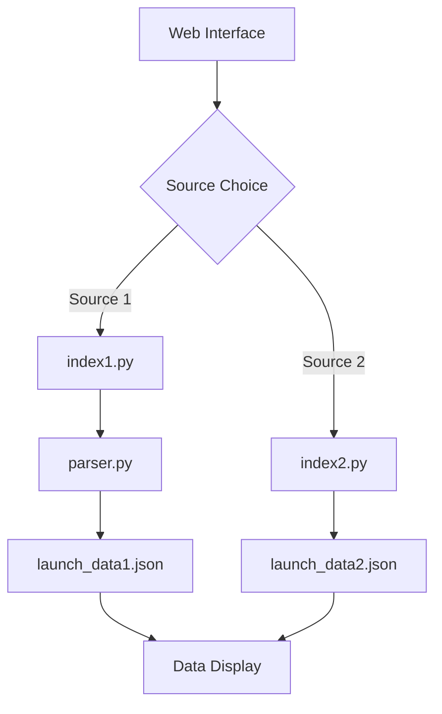

# Spaceflight Launch Data Aggregator

## 📋 Overview

This project provides a web-based interface to fetch and display upcoming spaceflight launch data from multiple sources. It leverages Python's Flask framework for the web application, BeautifulSoup for web scraping, and JSON for data handling.

## 🏗️ Project Architecture

The project consists of four main Python files that work together to create a complete data aggregation system:

```
spaceflight-aggregator/
├── app.py                 # Main Flask application
├── index1.py             # Scraper for destination-orbite.net
├── index2.py             # Scraper for nextspaceflight.com
├── parser.py             # Data enrichment (company inference)
├── templates/
│   └── index.html        # User interface
├── launch_data1.json     # Data from destination-orbite.net
└── launch_data2.json     # Data from nextspaceflight.com
```

## 🚀 Key Features

- **Multi-source scraping**: Automatic extraction from two specialized websites
- **Data enrichment**: Automatic inference of space companies
- **Intuitive web interface**: Trigger extractions through the UI
- **Standardized JSON format**: Structured and easily exploitable data
- **Robust error handling**: Exception handling with informative messages

## 📦 Dependencies

```bash
pip install flask requests beautifulsoup4
```

## 🔧 Installation and Usage

1. **Clone or download the project**
2. **Install dependencies**:
   ```bash
   pip install flask requests beautifulsoup4
   ```
3. **Run the application**:
   ```bash
   python app.py
   ```
4. **Access the interface**: http://127.0.0.1:5000

## 📄 Component Documentation

### app.py - Main Flask Application

**Role**: Main web server that orchestrates scraper execution and provides API endpoints.

#### Available Endpoints

| Route | Method | Description |
|-------|---------|-------------|
| `/` | GET | Displays the main interface |
| `/executer_code_1` | POST | Launches destination-orbite.net scraping |
| `/executer_code_2` | POST | Launches nextspaceflight.com scraping |

#### Detailed Operation

**Route `/executer_code_1`**:
1. Executes `index1.py` via subprocess
2. Executes `parser.py` to enrich the data
3. Reads `launch_data1.json` and returns data to frontend

**Route `/executer_code_2`**:
1. Executes `index2.py` via subprocess  
2. Reads `launch_data2.json` and returns data to frontend

#### JSON Response Example
```json
{
  "message": "",
  "launch_data": [
    {
      "name": "Falcon 9 | Starlink Group 6-77",
      "date": "2025-01-15",
      "hour": "10:30",
      "company": "SpaceX"
    }
  ]
}
```

### index1.py - Destination Orbite Scraper

**Source**: https://destination-orbite.net/astronautique/lancements/calendrier/

#### Main Methods

**`fetchLaunches_destination_orbite(url)`**
- Performs HTTP GET request to the target site
- Parses HTML with BeautifulSoup
- Extracts launch names, dates, and times
- Returns three lists: `launch_names`, `launch_dates`, `launch_hours`

**`save_launches_to_json()`**
- Formats extracted data as JSON
- Saves to `launch_data1.json`

#### Targeted HTML Structure
```html
<div class="row g-0 bg-dark">
  <ul class="list-unstyled mt-5">
    <li>Date: 2025-01-15</li>
    <li>Heure: 10:30</li>
  </ul>
  <p class="bg-white text-dark p-3 fw-bold">Launch name</p>
</div>
```

### index2.py - Next Spaceflight Scraper

**Source**: https://nextspaceflight.com/launches/

#### Extracted Data
- **Companies**: Via `mdl-card__title-text` class
- **Launch names**: Via `header-style` class  
- **Dates and times**: Via `mdl-card__supporting-text` class

#### Temporal Data Processing
The script uses regular expressions to differentiate:
- **With time**: Format `YYYY-MM-DD HH:MM`
- **Without time**: Format `YYYY-MM-DD NET` (hour = `null`)

#### Output Example
```json
{
  "company": "SpaceX",
  "name": "Falcon Heavy | Europa Clipper",
  "date": "2025-02-01",
  "hour": "14:30"
}
```

### parser.py - Data Enrichment

**Purpose**: Add "company" information to `destination-orbite.net` data by analyzing launch names.

#### Detected Companies

| Company | Keywords |
|---------|----------|
| SpaceX | falcon |
| MHI | michibiki |
| Rocket Lab | electron, curie |
| CASC | casc, chang, march march, zheng |
| Arianespace | ariane, vega |
| ISRO | isro, lvm, pslv, sslv |
| Roscosmos | soyuz |
| ULA | atlas |
| Blue Origin | new glenn, new-glenn, glenn |
| Orbital Science | minotaur |

#### Detection Algorithm
1. Convert name to lowercase
2. Sequential keyword search
3. Assign first match found
4. Default value: `"???"` if no match

## 🔄 Data Flow



## 📊 Data Format

### Common JSON Structure
```json
{
  "name": "string",      // Launch name
  "date": "string",      // Date in YYYY-MM-DD format
  "hour": "string|null", // Time in HH:MM format or null
  "company": "string"    // Space company name
}
```

### Source-specific Differences

| Field | destination-orbite.net | nextspaceflight.com |
|-------|------------------------|---------------------|
| company | Inferred by parser.py | Extracted directly |
| date | French format | International format |
| hour | Always present | Can be null |

## 🛠️ Maintenance and Extension

### Adding a New Company to Parser
```python
new_company_words = ['word1', 'word2']

# Add in detecter_mots_et_attribuer_company function
for mot in new_company_words:
    if mot.lower() in nom:
        company_value = "New Company"
        break
```

### Adding a New Source
1. Create a new file `index3.py`
2. Implement scraping functions
3. Add endpoint in `app.py`
4. Update `index.html` interface

## ⚠️ Limitations and Considerations

### External Dependencies
- **HTML Structure**: Scrapers depend on target site structure
- **Site Availability**: Possible failures if sites are unavailable
- **Rate Limiting**: No request throttling management

### Possible Improvements
- **Data Caching**: Avoid repeated requests
- **Automatic Scheduling**: Periodic data updates
- **Database**: More robust persistence than JSON files
- **Standardized API**: Complete RESTful endpoints
- **Unit Tests**: Validation of scraper behavior

## 🔍 Debugging

### Useful Logs
```python
# In scrapers
print(f"Response status: {response.status_code}")
print(f"Found {len(launches)} launches")

# In Flask application
app.run(debug=True)  # Enable detailed logs
```

### Common Errors
- **HTML Structure Changes**: CSS selector updates needed
- **Network Timeout**: Add timeouts to requests
- **Encoding Issues**: Problems with special characters

## 📝 Author and Version

- **Author**: Julien VIGNAU-ESPINE
- **Creation Date**: 14-01-2025
- **Version**: 1.0

---

